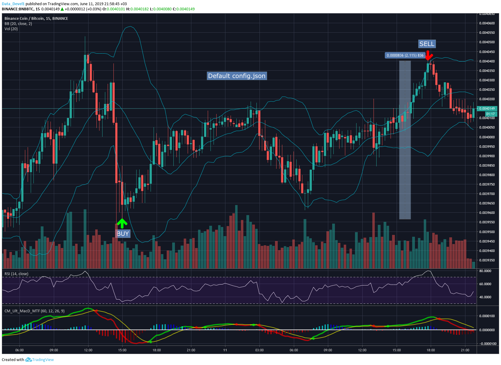

# AXE Bot - Crypto Trading Bot for Binance.com


## Disclaimer

> USE THE SOFTWARE AT YOUR OWN RISK. THE AUTHOR AND ALL AFFILIATES ASSUME NO RESPONSIBILITY FOR YOUR TRADING RESULTS.

### Features

> [Ignore signals](FAQ.md#what-means-ignore-buy-sell-signals)

> [Ready strategies](#ready-strategies)

> [Creating own strategy](#creating-own-strategy)

> BUY Trailing stop

> SELL Trailing stop

> Dynamic Trailing SELL

> Market or limit orders

> Indicators RSI, Bollinger Bands

> Notifications Telegram, Discord

> Facility to use different indicators for BUY and SELL

> Facility to use different timeframe for BUY and SELL indicators

> Saving trading results to Firebase or/and SQLite, for future visualization

---

> [Install](#install)

> [Config](#Config)

> [Update](#Update)

> [Say Me Thanks :)](#Donate)

---

#### Important

> After installing in Docker and first launch you MUST edit config.json and put there "bot_id", then [rebuild an image](#Update), because Docker doesn't save "bot_id" in config file while first run and will generate a new one for each run.

> Example code that you must put to the end of config.json: "bot_id": "YOUR BOT_ID"

> Note: after the previous line before "bot_id": "YOUR BOT_ID" you must put ",". After "bot_id": "YOUR BOT_ID" don't need put ",". Also, you need to mount "data" folder to your image, for saving results to SQLite or using Firebase.

#### Install

* [Docker](#docker)
* [Ubuntu](#ubuntu)
* [Windows](FAQ.md#i-want-to-install-the-bot-on-windows)

#### Docker

> Buy Ubuntu VPS near by exchange

```bash
sudo apt-get update
```

```bash
sudo apt-get install \
    apt-transport-https \
    ca-certificates \
    curl \
    gnupg-agent \
    software-properties-common
```

```bash
curl -fsSL https://download.docker.com/linux/ubuntu/gpg | sudo apt-key add -
```

```bash
sudo add-apt-repository \
   "deb [arch=amd64] https://download.docker.com/linux/ubuntu \
   $(lsb_release -cs) \
   stable"
```

```bash
sudo apt-get update
```

```bash
sudo apt-get install docker.io git
```

```bash
git clone https://github.com/alex-bormotov/AXE-Bot
```

```bash
cd AXE-Bot/config
```

```bash
cp config.json.sample config.json
```

> Edit config.json, it an IMPORTANT to create and edit config.json before docker build!

```bash
cd ..
```

```bash
sudo docker build -t axe-bot .
```

```bash
sudo docker run axe-bot &
```

> If you want change something in config.json you will need to [rebuild the docker image after changes](#Update)!

#### Ubuntu

```bash
sudo apt install python3-pip git
```

```bash
git clone https://github.com/alex-bormotov/AXE-Bot
```

```bash
cd AXE-Bot
```

```bash
pip3 install -r requirements.txt
```

```bash
cd config
```

```bash
cp config.json.sample config.json
```

```bash
nano config.json
```

```bash
cd ..
```

``` bash
python3 bot.py &
```

---

#### Update

> For Docker:

```bash
cd AXE-Bot
```

```bash
sudo docker ps
```

```bash
sudo docker stop CONTAINER ID
```

```bash
sudo docker rm CONTAINER ID
```

```bash
sudo docker rmi axe-bot
```

```bash
git pull origin master
```

```bash
sudo docker build -t axe-bot .
```

```bash
sudo docker run axe-bot &
```

> For Ubuntu, without Docker:

```bash
cd AXE-Bot
```

```bash
git pull origin master
```

```bash
ps ax | grep bot.py
```

```bash
kill -9 PROCESS ID
```

```bash
python3 bot.py &
```

---

#### Config

> key and value must be into "", for instance "exchange_fee": "0.1"

key|value|description
|:----------|:-------------:|------:|
exchange_for_trade|`       binance       `|Currently supports Binance only
requests_frequency|`       number        `|Frequency of requests (get price, get balances, check indicators, check orders, etc ...), in seconds, default 1
key|       `text`       |Binance API key
secret|    `text`       |Binance API secret
exchange_fee|       `number`       |0.1, on Binance (without using BNB)
use_bnb_for_fee|       `YES / NO`       |If YES - enable BNB fee on your Binance account
coin|       `text`       |First currency, "ETH" for instance
coin_2|       `text`       |Second (base) currency, "BTC" for instance
use_limit_orders|       `YES / NO`       |YES
cancel_order_by_time|       `YES / NO`       |YES
time_to_cancel_order_by_inactivity_minutes|       `number`       |In minutes. If limit order don't executed through this time it will be canceled. 7, for instance
use_all_balance|       `YES / NO`       |YES
buy_trail_step|       `number`       | If you do not want use trail buy - set very small number here, for instance 0.000001. Then bot will buy instantly
stake_per_trade|       `number`       |100
sell_trail_step|       `number`       |If you don't using SELL signal - from start stop loss will be equal `sell_trail_step`, after, as the price moves, it will change, because it is trailing stop loss
dynamic_trail_enable       |`YES / NO`       |If `YES` - It will be dynamically change value of `sell_trail_step`
dyn_change_percent_for_trail_1|       `number`       |For instance, if price now > 1% (set 1.0 here) - set trail to `dyn_trail_step_1`, that be equal 0.1
dyn_change_percent_for_trail_2|       `number`       |For instance, if price now > 1.2% (set 1.2 here) - set trail to `dyn_trail_step_2`, that be equal 0.09
dyn_change_percent_for_trail_3|       `number`       |For instance, if price now > 1.5% (set 1.5 here) - set trail to `dyn_trail_step_3`, that be equal 0.07
dyn_change_percent_for_trail_4|       `number`       |For instance, if price now > 1.7% (set 1.7 here) - set trail to `dyn_trail_step_4`, that be equal 0.06
dyn_change_percent_for_trail_5|       `number`       |For instance, if price now > 1.9% (set 1.9 here) - set trail to `dyn_trail_step_5`, that be equal 0.05
dyn_trail_step_1|       `number`       | 0.1, for instance
dyn_trail_step_2|       `number`       | 0.09, for instance
dyn_trail_step_3|       `number`       | 0.07, for instance
dyn_trail_step_4|       `number`       | 0.06, for instance
dyn_trail_step_5|       `number`       | 0.05, for instance
indicators_bb_period|       `number`       |20, for instance
indicators_rsi_period|       `number`       |14, for instance
buy_indicators_type|`RSI+BB / RSI / BB`|RSI+BB, for instance
buy_indicators_timeframe| `1, 5, 15, 30m or 1, 4h, 1d`|15m, for instance. Must be like 15m, means with `m`
rsi_buy_level|       `number`       |35, for instance
start_buy_trail_on_buy_signal|       `YES / NO`       |If set to `NO` bot will start buy instantly, if `YES` - only on a signal
ignore_buy_signal_enable|       `YES / NO`       |[FAQ](FAQ.md#what-means-ignore-buy-sell-signals)
ignore_buy_signal_type|       `times / time`       |[FAQ](FAQ.md#what-means-ignore-buy-sell-signals)
ignore_buy_signal_times|       `number`       |4, for instance [FAQ](FAQ.md#what-means-ignore-buy-sell-signals)
ignore_buy_signal_time_sec|       `number`       |In seconds, 120 (2m), for instance [FAQ](FAQ.md#what-means-ignore-buy-sell-signals)
ignore_buy_cooldown_sec|       `number`       |In seconds, 30, for instance [FAQ](FAQ.md#what-means-ignore-buy-sell-signals)
sell_indicators_type|`RSI+BB / RSI / BB`|RSI+BB, for instance
sell_indicators_timeframe| `1, 5, 15, 30m or 1, 4h, 1d`|15m, for instance. Must be like 15m, means with `m`
rsi_sell_level|       `number`       |77, for instance
start_sell_trail_on_sell_signal|       `YES / NO`       |If set to `NO` bot will start sell according with `sell_trail_step`, if `YES` - only on a sell signal
ignore_sell_signal_enable|       `YES / NO`       |[FAQ](FAQ.md#what-means-ignore-buy-sell-signals)
ignore_sell_signal_type|       `times / time`       |[FAQ](FAQ.md#what-means-ignore-buy-sell-signals)
ignore_sell_signal_times|       `number`       |3, for instance [FAQ](FAQ.md#what-means-ignore-buy-sell-signals)
ignore_sell_signal_time_sec|       `number`       |In seconds, 300 (5m), for instance [FAQ](FAQ.md#what-means-ignore-buy-sell-signals)
ignore_sell_cooldown_sec|       `number`       |In seconds, 30, for instance [FAQ](FAQ.md#what-means-ignore-buy-sell-signals)
price_buffer_for_start_sell_on_sell_signal|       `number`       |0.7, for instance. It like insurance, if was receive sell signal, but price now < price buy. In this case bot will be ignore sell signals until price now >= price buy + 0.7%
use_stop_loss_while_start_sell_on_sell_signal|       `YES / NO`       |If `YES` - sell if price now < price buy + `stop_loss_percent_for_start_sell_on_sell_signal`
stop_loss_percent_for_start_sell_on_sell_signal|       `number`       |7.0, for instance
common_cooldown_time_sec|       `number`       |In seconds, 1200 (20m), for instance. It means time which bot will be sleep in the end of each cycle (buy - sell), before starting a new cycle. It you want to disable this feature - set 0 here.
save_to_sqlite|       `YES / NO`       |save trade result
save_to_firebase|       `YES / NO`       |save trade result
firebase_credentials_file_name|       `text`       |"config/filename.json"
firebase_databaseURL|       `text`       |"https://your-url.firebaseio.com/"
telegram_enable|       `YES / NO`       |YES
chat_id|       `number`       |Telegram chat [id](https://www.reddit.com/r/Telegram/comments/7znf6s/how_do_i_find_my_telegram_id/)
token|       `text`       |Telegram [bot](https://core.telegram.org/bots#3-how-do-i-create-a-bot) token
discord_enable|       `YES / NO`       |YES
discord_webhook_url|       `text`       |Discord [WEBHOOK_URL](https://support.discordapp.com/hc/en-us/articles/228383668-Intro-to-Webhooks)|
bot_id |       `text`       |your unique id, DON'T CHANGE IT!

---

#### Ready Strategies


Strategy | Config file
|----------|:-------------:|
[Indicators only](data/strategy-1.png) | config.json.sample
Tested and make profit | YES
Exchange | Binance (spot)
Pair | BNB/BTC
Use all balance | YES
Fee in BNB | YES
Timeframe | 15m
Order type | limit
Cancel by inactivity | YES (7m)
Stop loss | NO
Dynamic trailing | NO
Trailing Buy | YES (0.007)
Trailing Sell | YES (0.007)
Start Buy on signal | YES
Start Sell on signal | YES
Indicators | RSI+BB
BB period | 20
RSI period | 14
RSI Buy | 35
RSI Sell | 77
Sell with profit only | YES (0.7% min)

---

Strategy | Config file 
|----------|:-------------:|
[Indicators and "ignore indicators" feature](FAQ.md#what-means-ignore-buy-sell-signals) | config.json.sample_2 
Tested and make profit | YES 
Exchange | Binance (spot) 
Pair | BNB/BTC 
Use all balance | YES 
Fee in BNB | YES 
Timeframe | 15m 
Order type | market 
Stop loss | NO 
Dynamic trailing | NO 
Trailing Buy | YES (0.1) 
Trailing Sell | YES (0.2) 
Start Buy on signal | YES 
Ignore Buy signal | YES 
Ignore Buy signal type | times 
Ignore Buy signal times | 6 
Ignore Buy cooldown (sec) | 900 
Start Sell on signal | YES 
Ignore Sell signal | YES 
Ignore Sell signal type | times 
Ignore Sell signal times | 4 
Ignore Sell cooldown (sec) | 900 
Indicators | RSI+BB 
BB period | 20 
RSI period | 14 
RSI Buy | 29 
RSI Sell | 79 
Sell with profit only | YES (0.7% min) 
Common cooldown (sec) | 7200 

##### Creating own strategy

> Before do it, please, read the [Docs](#config) and [FAQ](FAQ.md)

##### Example strategy

> BUY on signal, RSI<=35 or/and price>=BB_LOW (timeframe 15m), then start trailing SELL, or wait SELL signal and start trail sell after

> SELL on signal, RSI>=77 or/and price>=BB_UP (timeframe 15m), with minimal or more guaranteed (0.7%) `price_buffer_for_start_sell_on_sell_signal` profit, if price goes up, of course ;)

> While using SELL on sell signal you may insurance risk and set stop loss `use_stop_loss_while_start_sell_on_sell_signal`,  `stop_loss_percent_for_start_sell_on_sell_signal` - WATCH OUT!

> If you don't using SELL signal - stop loss will be equal (sell_trail_step), and will be changed after with `dynamic_trail_enable` help

---

##### Donate

> This is my second Python project

> If my code was useful for you may buy me tea:

> [My Binance Referal Link](https://www.binance.com/en/register?ref=35560900)

> BTC 1LTwU8hVYxxpHUDf3wYNDjnS9kK4PDdtgT

> ETH 0x23913F4ab3839a8b7bB987F348b8d974C045Dd17
